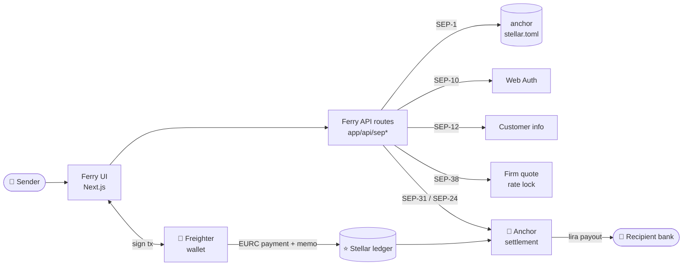
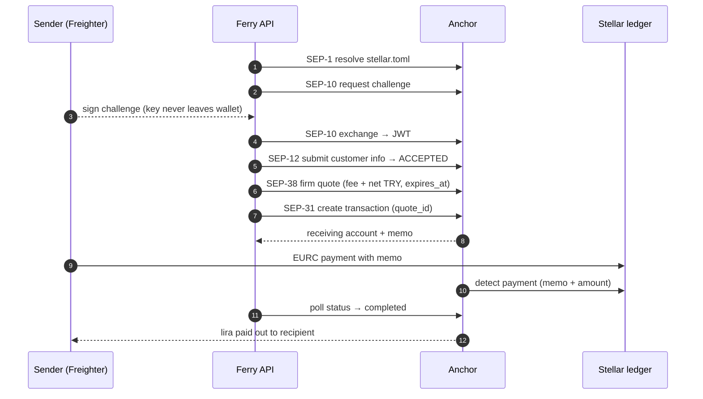

# ⛴️ Ferry

### Non-custodial cross-border remittance orchestration on Stellar

*Ferry connects a sender, a EUR-side anchor and a TRY-side anchor through open Stellar protocols — it never holds funds, keys or identity documents.*

[](https://stellar.expert/explorer/testnet)
[](https://nextjs.org)
[](https://react.dev)
[](https://www.typescriptlang.org)
[](https://tailwindcss.com)
[-2EA44F?logo=vitest&logoColor=white)](#-testing)
[](https://ferry-kappa-ten.vercel.app)

[**🌐 Live Demo**](https://ferry-kappa-ten.vercel.app) ·
[**🏗️ Architecture**](#-architecture--remittance-lifecycle) ·
[**📄 Verification Report**](docs/evidence/corridor-verification/corridor-verification-report.pdf) ·
[**🔗 Testnet Hashes**](TESTNET_HASHES.md) ·
[**📋 Gap Analysis**](GAP_ANALYSIS.md)

</div>

---

> [!IMPORTANT]
> **Project status (2026-10-08): Testnet only.** Ferry's full SEP-10 → SEP-12 → SEP-38 → SEP-31 flow settles real on-chain EURC transfers on the Stellar **test network**. The TRY side currently runs against Ferry's own **simulated anchor** — no licensed EUR or TRY anchor has confirmed the corridor in writing yet, and no Mainnet deployment or real funds exist. See [`GAP_ANALYSIS.md`](GAP_ANALYSIS.md) for the exact status of every SOW criterion.

## 📑 Table of Contents

- [Overview](#-overview)
- [Key Features](#-key-features)
- [Supported Corridor & Economics](#-supported-corridor--economics)
- [Architecture & Remittance Lifecycle](#-architecture--remittance-lifecycle)
- [SCF Deliverables & Verification Evidence](#-scf-deliverables--verification-evidence)
- [Local Development & Setup](#-local-development--setup)
- [Testing](#-testing)
- [Repository Layout](#-repository-layout)
- [License & Acknowledgments](#-license--acknowledgments)

---

## 🌍 Overview

Sending money from the euro area to Turkey is still slow and opaque. Bank wires pass through correspondent banks that each take a cut, take days to settle, and rarely show the real exchange-rate margin up front. The global average cost of sending a remittance is 6.36% — more than double the UN SDG 10.c target of below 3% by 2030 (see [`README` sources in `CORRIDOR_VERIFICATION.md` §7](CORRIDOR_VERIFICATION.md)).

**Ferry** is an orchestration layer for this corridor. Licensed Stellar *anchors* do what only they are allowed to do — take euros in, verify identity, pay lira out — and Ferry coordinates them through Stellar's open standards (SEPs):

- The sender sees a **firm, itemised quote** (exact lira amount after fees) **before** committing any money.
- The value moves between anchors on Stellar, where a ledger closes in about **5 seconds**.
- Ferry **never takes custody** of funds, keys or identity documents — and adds **no fee or exchange-rate margin of its own**.

## ✨ Key Features

| | Feature | What it means |
|---|---|---|
| 🔐 | **Non-custodial by design** | Ferry holds no funds and no private keys. Every transaction is signed in the user's own wallet ([Freighter](https://www.freighter.app)); see [`docs/KEY_MANAGEMENT.md`](docs/KEY_MANAGEMENT.md). |
| 🪙 | **Zero-balance architecture** | Ferry has no balance to lose or freeze. Money moves directly between the user and licensed anchors; any refund comes from the anchor holding the funds ([`docs/REFUND_AND_INCIDENT_PROCEDURES.md`](docs/REFUND_AND_INCIDENT_PROCEDURES.md)). |
| 🧾 | **KYC stays with the anchor** | Identity data goes to the licensed anchor through SEP-12 or the anchor's hosted SEP-24 page — never stored by Ferry. |
| 📜 | **SEP-compliant** | SEP-1, SEP-10, SEP-12, SEP-24, SEP-31 and SEP-38, spoken through Ferry's own server routes in `app/api/`. |
| 🔒 | **Rate lock before payment** | SEP-38 firm quotes are locked with a `quote_id`; Ferry blocks sending once a quote has expired. |
| 🧯 | **Designed failure matrix** | Anchor rejection, failed KYC, invalid IBAN and expired quote each end on a dedicated error screen with a clean-refund status — caught before any money moves. |
| 🔁 | **Idempotent orchestration** | Idempotency keys, scoped retry-with-backoff, rate limiting and structured logging on every anchor-facing call. |
| 🧪 | **Embedded mock anchor** | A simulated TRY anchor runs inside the app itself (`app/api/mock-anchor/*`) or standalone (`mock-anchor/`), so the full corridor is testable end-to-end on Testnet before anchor contracts exist. |

## 💱 Supported Corridor & Economics

### EUR (EURC) → TRY

| Leg | Asset | Status |
|---|---|---|
| **Sending (EUR)** | Circle's **EURC** on Stellar (Testnet issuer `GB3Q6QDZYTHWT7E5PVS3W7FUT5GVAFC5KSZFFLPU25GO7VTC3NM2ZTVO`, verified against Circle's docs and on-chain data) | Real asset, Testnet |
| **Receiving (TRY)** | `TRY` test asset issued by Ferry's simulated anchor | **Simulated** — not a fiat-backed lira token, not a licensed anchor |
| **Production anchors** | Licensed EUR-side and TRY-side anchors | Outreach in progress; no written confirmation yet |

### Testnet transfers — 2026-10-08

Run through Ferry's own API routes against the simulated anchor, using a **fixed test rate of 1 EURC = 55.35 TRY** and the simulated anchor's 0.5% fee. The rate is a test setting, not a live market quote. Every hash is checkable on [Stellar Expert](https://stellar.expert/explorer/testnet).

| Transfer | EURC sent | Anchor fee (0.5%) | Converted | Rate | TRY to recipient | EURC payment tx |
|---|--:|--:|--:|--:|--:|---|
| **A** | 5.0000000 | 0.0250000 | 4.9750000 | 55.35 | **275.3662500** | [`99389e9d…e561`](https://stellar.expert/explorer/testnet/tx/99389e9daf565ee4beb1f78a76e2beb429b9c8abdbfd2e167acdf237184ee561) |
| **B** | 2.5000000 | 0.0125000 | 2.4875000 | 55.35 | **137.6831250** | [`58ce0f34…2e57`](https://stellar.expert/explorer/testnet/tx/58ce0f347152d8f7343b79d3a4826e89848e909e351b9a904286f47790322e57) |
| **C** | 1.0000000 | 0.0050000 | 0.9950000 | 55.35 | **55.0732500** | [`bd7c7f1a…0db8`](https://stellar.expert/explorer/testnet/tx/bd7c7f1aead32408fc0f64517f6e1f68c3515f29caf6a10c1acebcdffe580db8) |

**Formula:** `TRY to recipient = (EURC sent − fee) × rate`, with `fee = 0.5% × EURC sent`. Full log, payout hashes and ledger timestamps: [`TESTNET_HASHES.md` §11](TESTNET_HASHES.md).

### Cost landscape (reference figures, €1,000, recorded 2026-08-16)

| Channel | Basis | Recipient receives | Indicative all-in cost |
|---|---|--:|--:|
| Wise | Live quote (mid-market 55.4001 TRY/EUR, fee €6.91) | 55,017.29 TRY | €6.91 (0.69%) |
| Western Union | Estimate from published fee/markup data | ≈ 52,350 – 54,735 TRY | ≈ €12 – €55 |
| Bank wire (SWIFT) | Estimate incl. intermediary fees | ≈ 47,644 – 51,522 TRY | ≈ €70 – €140 |
| **Ferry** | Anchor-set pricing, no Ferry margin | Pending anchor agreements | Pending anchor agreements |

Sources and caveats for each row: [`CORRIDOR_VERIFICATION.md` §7](CORRIDOR_VERIFICATION.md). A measured, same-day comparison using real transfers through each channel is part of Deliverable 1 and has not been completed yet.

## 🏗️ Architecture & Remittance Lifecycle



**SEP-31 lifecycle, step by step:**



The SEP-24 hosted deposit/withdrawal path opens the anchor's own interactive page in a pop-up, so KYC and bank details are entered directly with the anchor ([`TESTNET_HASHES.md` §5](TESTNET_HASHES.md)).

**Separation of concerns** (per [`CLAUDE.md`](CLAUDE.md)):

| Layer | Location | Responsibility |
|---|---|---|
| UI | `app/`, `components/` | Quote calculator, transfer panel, status tracker, error screens |
| Orchestrator | `app/api/sep10`, `sep12`, `sep24`, `sep31`, `sep38` | Server routes: allowlisting, idempotency, retry, rate limits, logging |
| Stellar logic | `lib/stellar/` | SEP clients, `stellar.toml` resolution, trustlines, payments |
| Test harness | `app/api/mock-anchor/`, `mock-anchor/` | Simulated TRY anchor (Testnet only) |

## 📦 SCF Deliverables & Verification Evidence

Status as recorded in [`GAP_ANALYSIS.md`](GAP_ANALYSIS.md), which lists every SOW criterion with its evidence file.

| # | Deliverable | Status | Evidence |
|---|---|---|---|
| **1** | **Corridor Verification, Pilot Terms & Cost Baseline** | ❌ **Not met** — written anchor confirmations and agreed pilot terms are still outstanding | [`docs/evidence/corridor-verification/corridor-verification-report.pdf`](docs/evidence/corridor-verification/corridor-verification-report.pdf) · [`CORRIDOR_VERIFICATION.md`](CORRIDOR_VERIFICATION.md) · [`COST_BASELINE.md`](COST_BASELINE.md) |
| **2** | **Production-Grade Orchestration Service** | 🟡 **Substantially met** — all SEP integrations live; SEP-31 settled on-chain | [`TESTNET_HASHES.md`](TESTNET_HASHES.md) · [`vitest.config.mts`](vitest.config.mts) · 114 passing tests (see [Testing](#-testing)) |
| **3** | **Sender/Recipient Web Experience + Mainnet Readiness Pack** | 🟡 **Substantially met** — live app, failure matrix, readiness docs | [Live demo](https://ferry-kappa-ten.vercel.app) · [`docs/RUNBOOK.md`](docs/RUNBOOK.md) · [`docs/GO_LIVE_CHECKLIST.md`](docs/GO_LIVE_CHECKLIST.md) · [`docs/KEY_MANAGEMENT.md`](docs/KEY_MANAGEMENT.md) · [`docs/REFUND_AND_INCIDENT_PROCEDURES.md`](docs/REFUND_AND_INCIDENT_PROCEDURES.md) · [`docs/DEMO_SCRIPT.md`](docs/DEMO_SCRIPT.md) |

**Verifiable on-chain evidence** (all Stellar Testnet):

| Run | What it proves | Key transaction |
|---|---|---|
| 2026-10-08 · `TESTNET_HASHES.md` §11 | Three SEP-31 transfers at 55.35 TRY/EURC, settled and paid out | [`99389e9d…e561`](https://stellar.expert/explorer/testnet/tx/99389e9daf565ee4beb1f78a76e2beb429b9c8abdbfd2e167acdf237184ee561) |
| 2026-09-06 · `TESTNET_HASHES.md` §10 | Full flow against the live Vercel deployment's embedded anchor | [`9ae604b1…06f6`](https://stellar.expert/explorer/testnet/tx/9ae604b13088fb33573820ff891b0ef197501fd74bb3905403b090a8f74206f6) |
| 2026-08-20 · `TESTNET_HASHES.md` §9.4 | Anchor-side rejections (unsupported asset, limits, expired quote) — no funds sent | — |
| 2026-08-16 · `TESTNET_HASHES.md` §8.4 | First settled EURC transfer, signed in Freighter | [`5b6f6a33…af91`](https://stellar.expert/explorer/testnet/tx/5b6f6a3378f5e0cf446b420e1adc52b1027e0493869d5087d9ce8cb78c15af91) |

Scenarios that could **not** be reproduced on Testnet (anchor-side KYC and IBAN rejection) are listed explicitly in [`TESTNET_HASHES.md`](TESTNET_HASHES.md) rather than simulated.

## 🛠️ Local Development & Setup

### Requirements

- **Node.js 20.9+** (Next.js 16 requirement) and npm
- **[Freighter](https://www.freighter.app)** browser extension, switched to **Testnet**
- A Testnet account funded via [Friendbot](https://laboratory.stellar.org/#account-creator?network=test)

### Install

```bash
git clone https://github.com/emir-utku-ozgen/Ferry.git
cd Ferry
npm install
cp .env.local.example .env.local
```

### Configure `.env.local`

```bash
# Stellar network — Testnet only
NEXT_PUBLIC_STELLAR_NETWORK=TESTNET
NEXT_PUBLIC_HORIZON_URL=https://horizon-testnet.stellar.org
NEXT_PUBLIC_NETWORK_PASSPHRASE="Test SDF Network ; September 2015"

# Domain Ferry is served from (sent as home_domain in SEP-10)
NEXT_PUBLIC_HOME_DOMAIN=localhost:3000
NEXT_PUBLIC_APP_URL=http://localhost:3000

# Option A — use the embedded simulated TRY anchor (EURC → TRY corridor).
# Leave NEXT_PUBLIC_ANCHOR_DOMAIN unset; it defaults to this app's own domain.
NEXT_PUBLIC_ENABLE_EMBEDDED_MOCK_ANCHOR=true

# Option B — point at an external anchor instead (e.g. the SDF reference anchor,
# or the standalone mock-anchor/ on localhost:4001), and allowlist it.
# NEXT_PUBLIC_ANCHOR_DOMAIN=testanchor.stellar.org
# ANCHOR_ALLOWLIST=testanchor.stellar.org
```

Never put secret keys in `NEXT_PUBLIC_*` variables or commit `.env.local`. The full variable reference, including the embedded anchor's server-only keys and the Testnet → Mainnet switch, is in [`docs/RUNBOOK.md`](docs/RUNBOOK.md) §2.

### Run

```bash
npm run dev          # http://localhost:3000
```

Optional standalone simulated anchor (instead of the embedded one):

```bash
cd mock-anchor
npm install
node server.js       # http://localhost:4001 — see mock-anchor/README.md
```

## 🧪 Testing

```bash
npm test                     # Vitest — 83 tests (app, lib, components)
cd mock-anchor && npm test   # node:test — 31 tests (standalone mock anchor)
```

All 114 tests passed on 2026-10-08. There is no CI pipeline yet, so the test badge above reflects that local run.

## 📁 Repository Layout

```text
Ferry/
├── app/                    # Next.js App Router pages
│   ├── api/sep10|12|24|31|38/   # Orchestrator routes (server-side SEP calls)
│   ├── api/mock-anchor/    # Embedded simulated TRY anchor
│   └── .well-known/        # stellar.toml for the embedded anchor
├── components/             # Quote calculator, transfer panel, status tracker
├── lib/
│   ├── stellar/            # SEP clients, config, trustlines, payments
│   └── mockAnchor/         # Embedded anchor config, state, settlement
├── mock-anchor/            # Standalone Express mock anchor (Testnet only)
├── docs/                   # Runbook, key management, refunds, go-live, demo
│   └── evidence/corridor-verification/   # Deliverable 1 report (PDF + sources)
├── GAP_ANALYSIS.md         # SOW criterion-by-criterion status
├── CORRIDOR_VERIFICATION.md
├── COST_BASELINE.md
└── TESTNET_HASHES.md       # All on-chain evidence, dated and verifiable
```

## 📄 License & Acknowledgments

**License:** no license has been chosen yet — this repository currently contains no `LICENSE` file, so all rights are reserved by default. A license (for example MIT or Apache-2.0) will be added before the project is opened for external contribution.

**Acknowledgments**

- [Stellar Development Foundation](https://stellar.org) and the **Stellar Community Fund** for the SEP standards, Testnet infrastructure and the reference anchor at `testanchor.stellar.org`.
- [Circle](https://www.circle.com) for EURC on Stellar.
- [Freighter](https://www.freighter.app) for non-custodial wallet signing.

<div align="center">

Maintained by **Emir Utku Özgen** · [`emir-utku-ozgen/Ferry`](https://github.com/emir-utku-ozgen/Ferry)

*Testnet engineering project — no production funds, licensed anchor relationship or Mainnet deployment exists yet.*
